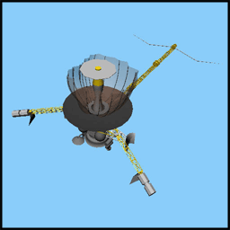

# Samples 

These Mdl files are from the Std data disc 2.0

# Models

# LICENSE from STK Data Disc 2.0

Terms of Use - STK Data Disclaimer
----------------------------------

Free Data
---------
AGI hereby grants you the right to use the content provided on the STK Data Disc, 
and the free data available via the STK Download Utility, 
with any AGI product or custom application that has been developed based upon an AGI tool. 
No additional licenses are required.  

Warranty Disclaimer
-------------------
AGI PROVIDES THIS DATA AS-IS WITHOUT WARRANTY OF ANY KIND, 
EITHER EXPRESS OR IMPLIED, INCLUDING BUT NOT LIMITED TO IMPLIED WARRANTIES OF 
MERCHANTABILITY AND FITNESS FOR A PARTICULAR PURPOSE.  
AGI DOES NOT GUARANTEE THE ACCURACY OF THIS DATA OR THAT IT WILL BE ERROR-FREE.  
YOU ACCEPT ALL RESPONSIBILITY AND LIABILITY RESULTING FROM YOUR SELECTION, 
USE AND RELIANCE ON CONCLUSIONS DRAWN FROM THE DATA.

Limitation of Remedies
----------------------
IN NO EVENT WILL AGI, OR ITS SUPPLIERS, BE LIABLE TO YOU FOR ANY DIRECT, 
INDIRECT OR OTHER DAMAGES, INCLUDING LOST PROFITS, LOST SAVINGS OR OTHER INCIDENTAL, 
SPECIAL OR EXEMPLARY DAMAGES ARISING OUT OF YOUR USE OR INABILITY TO USE THE DATA, 
EVEN IF AGI OR ITS SUPPLIERS HAD BEEN ADVISED OF THE POSSIBILITY OF SUCH DAMAGES.

Third Party Content
-------------------
AGI hereby acknowledges the following third party sources of the Free Data, 
and advises users to review any additional terms and conditions for the use of 
the Free Data that may be found at:

STK Celestial Imagery - Axel Mellinger website: 
* http://home.arcor-online.de/axel.mellinger

STK High Res Maps website: 
* http://www.evl.uic.edu/pape/data/WDB

STK World Terrain – USGS website: 
* http://edc.usgs.gov/products/elevation/gtopo30/README.html
* http://edc.usgs.gov/products/elevation/gtopo30/gtopo30.hmtl 
* http://www.usgs.gov/visual-id/credit_usgs.hmtl

City Database – NGA website: 
* http://earth-info.nga.mil/html/index.html, 
* http://earth-info.nga.mil/gns/hmtl/whatsnew.htm#C3

City Database – USGS website: 
* http://geonames.usgs.gov/domestic
* http://www.usgs.gov/laws/info_policies.html

Imagery – NASA website: 
* http://earthobservatory.nasa.gov/ImageUse
* http://earthobservatory.nasa.gov/BlueMarble

Imagery – GeoSphere: 
* http://www.geosphere.com

Imagery – USGS: 
* http://astrogeology.usgs.gov/About/Crediting

Imagery – NOAA: 
* http://dmsp.ngdc.noaa.gov/html/download_world_change_pair.hmtl, 
* http://www.ngdc.noaa.gov/ngdcinfo/privacy.html

Imagery – Living Earth: 
* http://livingearth.com

AGI does not promote nor guarantee the quality or content of the third party data.